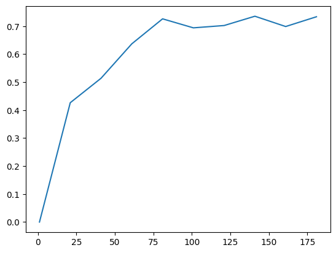

# Credit_Card_Fruad_Detection_By_Neutral_Network_With_Or_Without_Log_Transformation
About this project
========================
This is a credit card fraud classifier using features derived from credit card transactions.

The dataset is from https://www.kaggle.com/datasets/mlg-ulb/creditcardfraud?resource=download
It contains transactions made by credit cards in September 2013 by European cardholders.
Unfortunately, due to privacy reasons, most features (except "Time" and "Amount") have been transformed via PCA into V1-V28, with no original feature information available.

Encoder architecture
========================
* 30 features -> 64 nodes -> relu -> 48 nodes -> relu -> 32 nodes -> relu -> 2 logic output
* The final output uses argmax for classification

How to use
========================
1. Download the .csv dataset from the provided link.
2. Place it in the same folder as the notebook file and rename it to creditcard_cc_fruad.csv.
3. Run either:  
    *train_cc_fruad_by_encoder.ipynb  (without log transformation) 
    *train_cc_fruad_by_encoder_with_log_transformation.ipynb   (with log transformation)
4. Use the respective test notebooksto evulate:  
  test_with_log_transformation.ipynb
  test_without_log_transformation.ipynb

By default, checkpoints are saved before completing 20 epochs. The total training runs for 200 epochs, starting at epoch 1. Learning rate is 0.0001, batch size at training = 64.
Orignal data is split 80:20 as training:testing data set.

Train time: 30 minutes on RTX3060 laptop with both training run together.

Note
------------------------
Both trainer versions (log vs. no log transformation) save checkpoints with using the same name. Ensure they are run in separate folders to avoid conflicts.  

Test result
========================

F1 Score vs. Epochs
------------------------

Without Log Transformation

With Log Transformation

The model performs better without log transformation (F1 = 0.73) compared to the version with log transformation (F1 = 0.65).

Confusion Matrices
------------------------

No Log Transformation 

With Log Transformation

The confusion matrices confirm that the no log transformation version outperforms the log-transformed model in terms of classification accuracy and recall 
